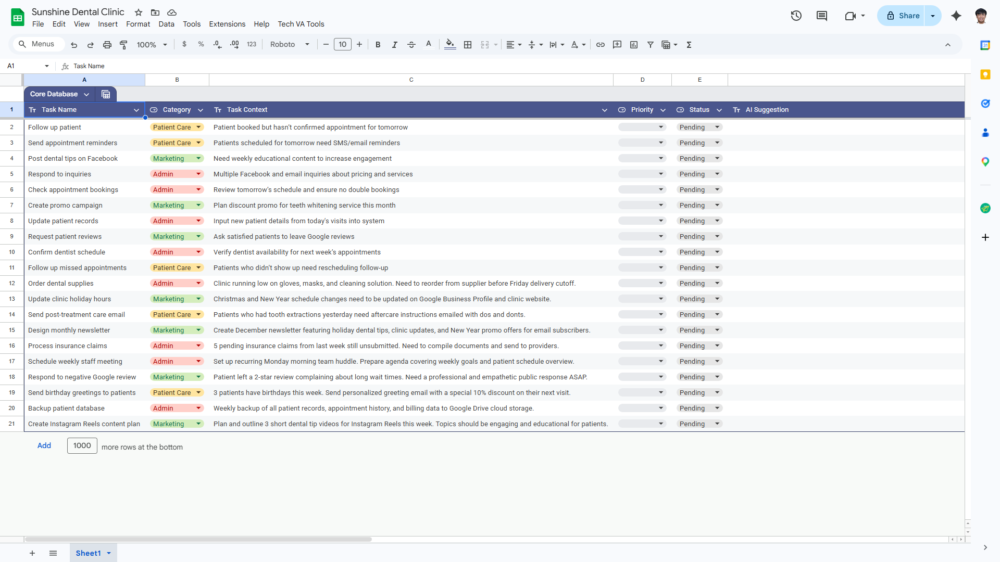
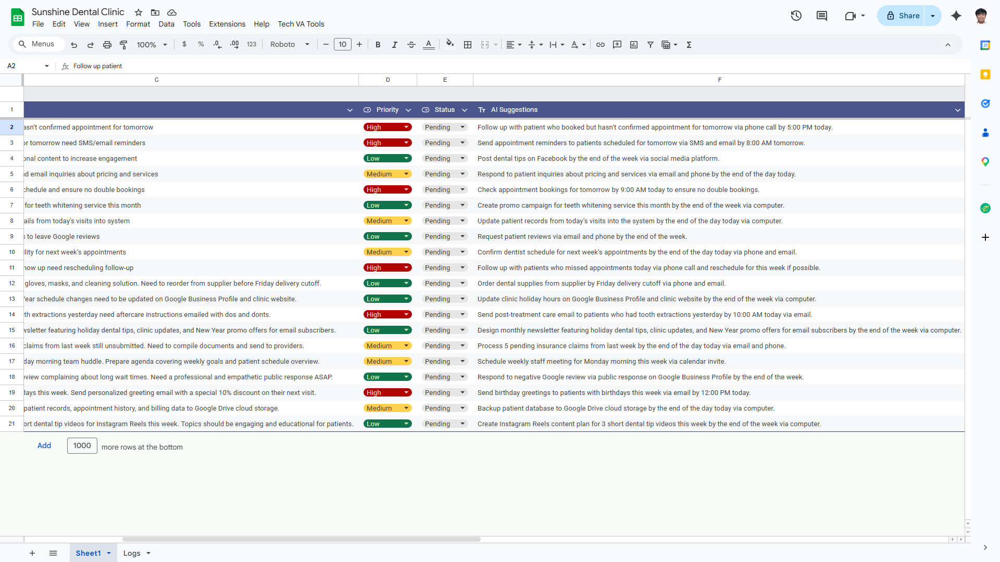

# 🦷 AI-Powered Tech VA Workflow System

## 📌 Overview
This project simulates a real-world Tech Virtual Assistant system for a dental clinic.

It automates task prioritization and generates actionable instructions using AI, helping reduce manual decision-making in daily operations.

---

## 🚀 What This System Does

- Takes raw task data from Google Sheets
- Uses AI to analyze task urgency and context
- Assigns priority levels (High / Medium / Low)
- Generates clear, time-bound, and actionable instructions

---

## 🧠 Example Transformation

### Before (Manual / Unstructured Tasks)

### After (AI-Powered Workflow Output)

---

## 💡 Key Features

- AI-powered prioritization using business rules
- Operational instructions (includes timing + channel)
- Batch processing of tasks
- Google Sheets dashboard interface
- Custom menu (Apps Script UI)

---

## ⚙️ Tech Stack

- Google Sheets
- Google Apps Script
- Groq API (LLaMA 3.1)
- JavaScript

---

## 🏗️ How It Works

1. Tasks are entered into Google Sheets
2. Script collects all task data
3. AI processes tasks in batch
4. System returns:
   - Priority level
   - Actionable instruction
5. Results are written back to the sheet

---

## 🎯 Purpose

This project demonstrates:
- AI workflow automation
- Task prioritization systems
- API integration
- Real-world Tech VA operations

---

## 📂 Project Structure

- `/scripts` → Google Apps Script code
- `/screenshots` → Before & After outputs

---

## 👤 Author

Jonathan – Aspiring Tech VA focused on automation, AI workflows, and data systems.
